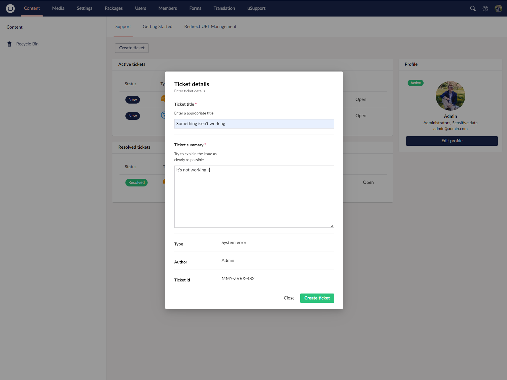
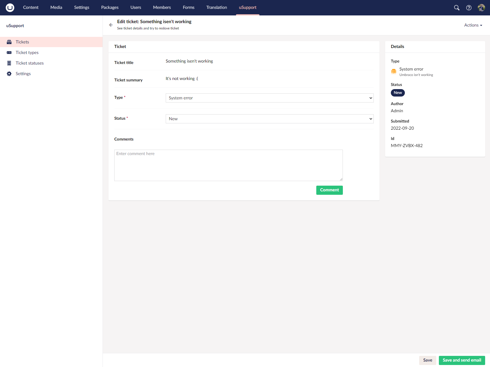
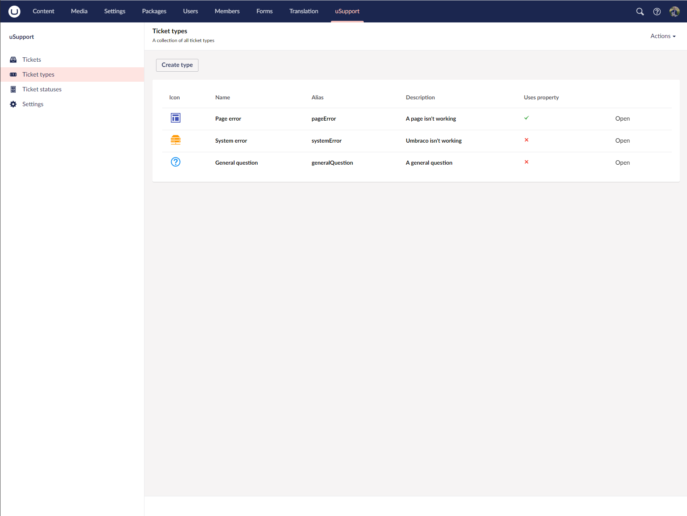
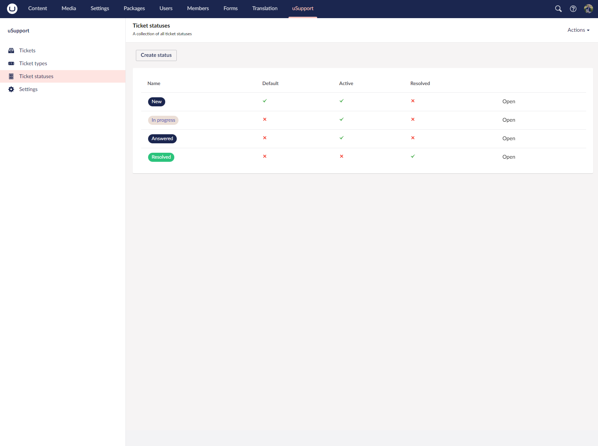
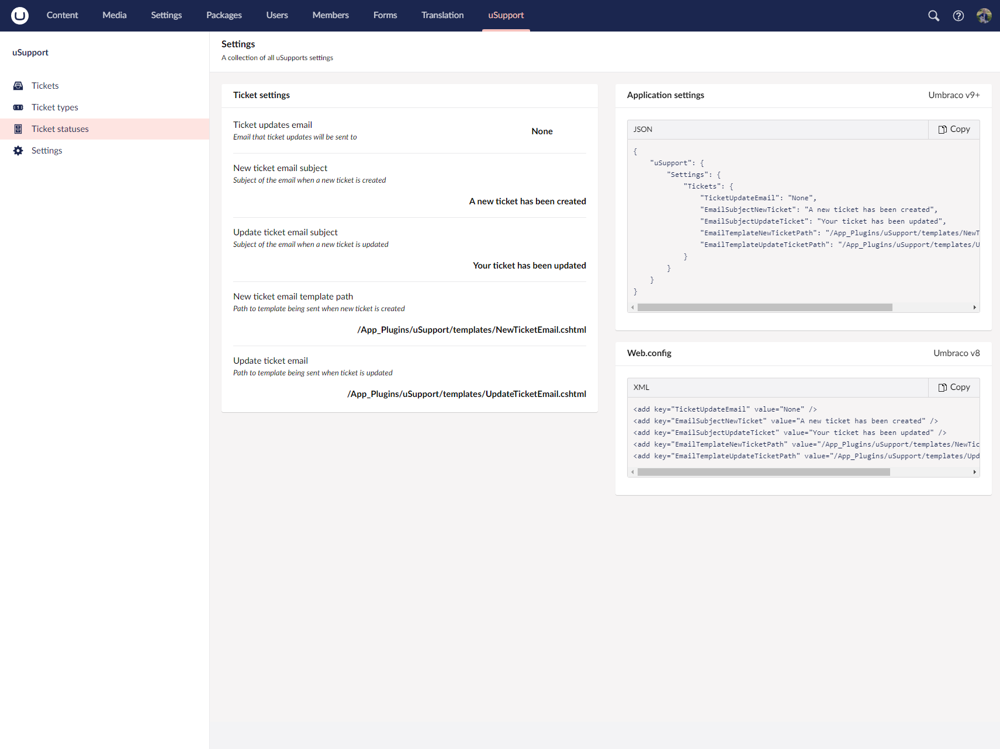

    

## What is uSupport
uSupport is an ticketing system built for Umbraco.

## Why uSupport
Instead of managing your clients Umbraco issues via email. Why not keep them in Umbraco. uSupport is highly flexable and customizable to make sure it fits your needs. No more rummaging through old emails to find the details of what needs to be fixed.

### Key features
* Friendly UI
* Customizable ticket types & statuses
* Comment on tickets
* Email notifications
* Ticketing dashboard

#### Getting started with uSupport
In order to view uSupports admin section. You will need to assign uSupport section to the desired user group. [You can read more here.](https://our.umbraco.com/Documentation/Fundamentals/Data/Users/#user-group-parameters) 

## Exentions

### uSupport hub
With uSupport hub you can now connect your clients sites to a hub. The hub allows you manage all connected sites tickets. You can manage ticket, ticket types/statuses. All via the hub.

## Screenshots

